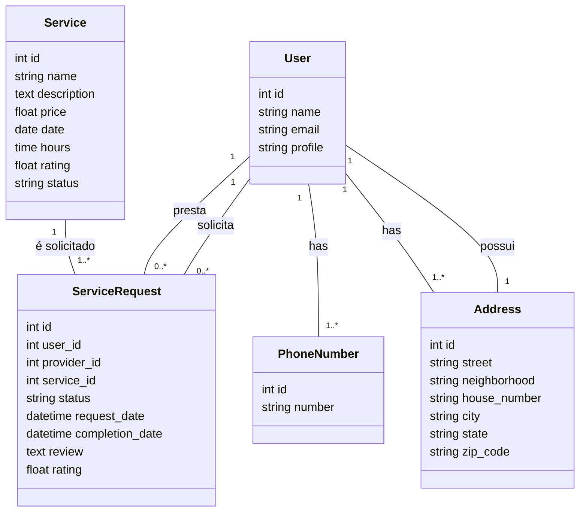

# 📌 Plataforma de Conexão entre Usuários e Prestadores de Serviço  

Este projeto é uma plataforma que conecta **usuários comuns** a **prestadores de serviço**.  
Usuários podem **buscar e requisitar serviços**, enquanto prestadores podem **cadastrar, gerenciar e aceitar solicitações** de clientes.  

## 🚀 Funcionalidades  
✅ Cadastro e autenticação de usuários (clientes e prestadores).  
✅ Busca e solicitação de serviços.  
✅ Cadastro, edição e exclusão de serviços por prestadores.  
✅ Aceitação ou recusa de solicitações de serviço.  
✅ Painel administrativo para gerenciamento dos dados.  

## Esquema do Banco de Dados



## 🛠️ Tecnologias Utilizadas  
- **Django** – Framework web Python.  
- **Django Authentication** – Sistema de autenticação de usuários.  
- **SQLite/PostgreSQL** – Banco de dados para armazenar as informações.  
- **Django Templates** – Interface baseada em HTML e CSS.  

## 📦 Instalação e Configuração  
```sh
### 1️⃣ Clone o repositório  

git clone https://github.com/Luisf66/Services_Py-Django.git
cd Services_Py-Django

### 2️⃣ Crie um ambiente virtual e instale as dependências

python -m venv venv
source venv/bin/activate  # No Windows: venv\Scripts\activate
pip install -r requirements.txt

### 3️⃣ Configure as migrações e rode o servidor

python manage.py migrate
python manage.py runserver

4️⃣ Acesse a plataforma

Abra seu navegador e acesse:
http://127.0.0.1:8000/
